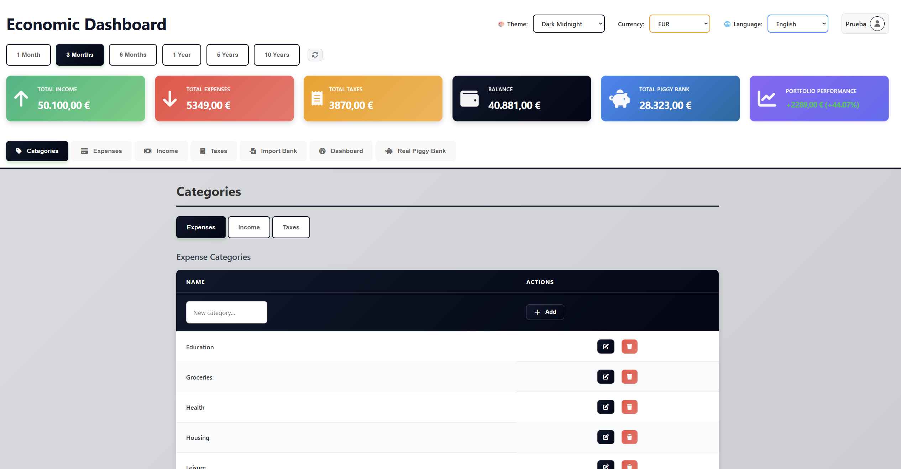

# Economic Dashboard

A lightweight personal finance dashboard to track income, expenses, savings, and assets. The app runs locally with Electron and stores data in a SQLite database per user. It focuses on clear charts, practical budgeting workflows, and quick data entry.

## Features

- Track income, expenses, savings, taxes, and cash buckets ("Hucha")
- Monthly summaries, category breakdowns, and trend charts
- Date range filters and category filtering
- Multilingual UI (ES, EN, PT, FR, EU, CA)
- 18+ theme options
- Asset tracking with live prices from Yahoo Finance
- Interest-bearing accounts with automatic interest calculations
- Bank import from CSV/XLS/XLSX

## Usage (Quick Guide)

1. Launch the app and create or select a user.
2. Create categories for expenses, income, and taxes.
3. Add one-time or monthly transactions.
4. Use the Dashboard tab to view summaries and trends.
5. Import bank files from the Import tab if needed.
6. Track assets and interest-bearing accounts for a complete view.

## Data Storage

- All data is stored locally, per user, under the usuarios/ folder.
- Each user has their own SQLite database and upload folder.
- No cloud sync is included by default.

## Bank Import

- Supported formats: CSV, XLS, XLSX.
- Files are saved per user and can be reviewed before importing.

## Assets and Prices

- Asset prices are fetched from Yahoo Finance.
- Prices are converted to EUR using an exchange rate API when needed.

## Screenshots

