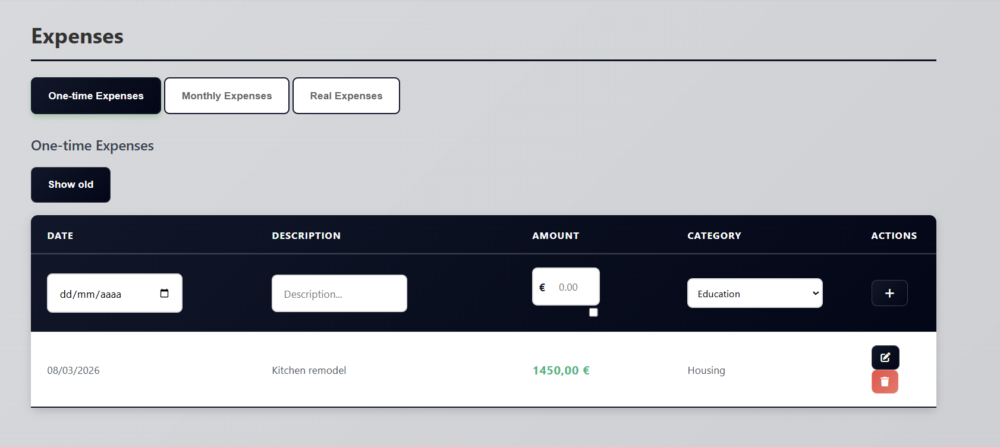
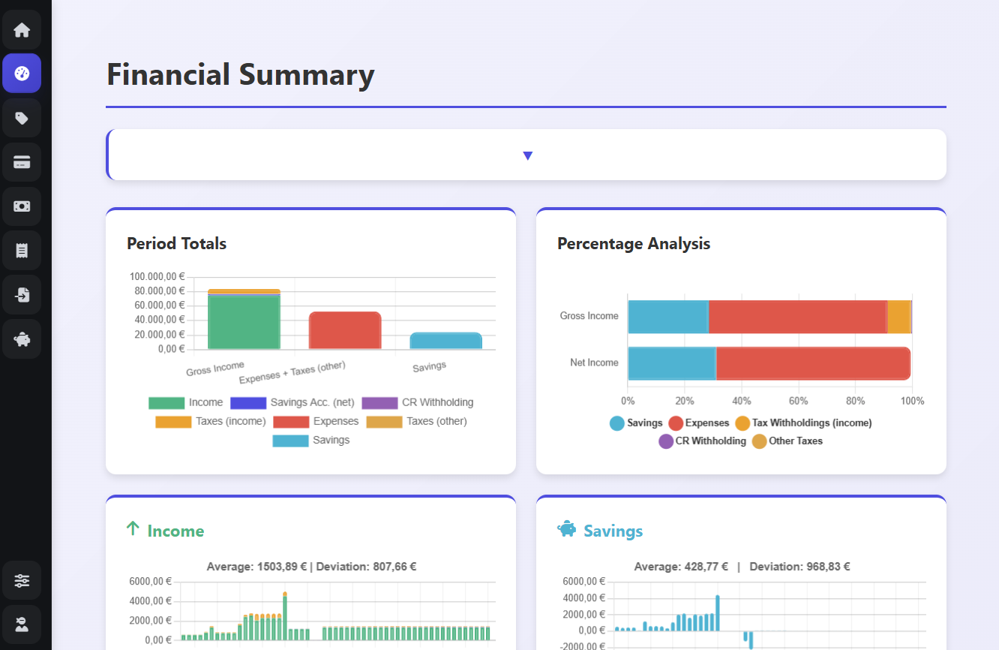

# Economic Dashboard

A lightweight **personal finance dashboard** to track your **income, expenses, and savings**. Visualize your financial data with **charts for monthly totals, category breakdowns, and trends**. Designed for simplicity and clarity, ideal for personal budgeting and financial planning.

---

## ✨ Features

- Track **income, expenses, and savings** over time  
- Visualize data by categories with **doughnut and stacked bar charts**  
- Calculate **monthly averages and variances**  
- Filter by **date range and category**  
- **Multilingual support** (ES, EN, PT, FR, EU)
- **18+ theme options** for customization
- **Asset management** with real-time stock prices via Yahoo Finance
- **Interest-bearing accounts** with automatic calculations
- **Modular architecture** for easy maintenance

---

## 🚀 Quick Start

### Installation

---

## Screenshots

### Monthly Overview

### Category Breakdown

---

---

## 📝 License

This project is for personal use.

---

